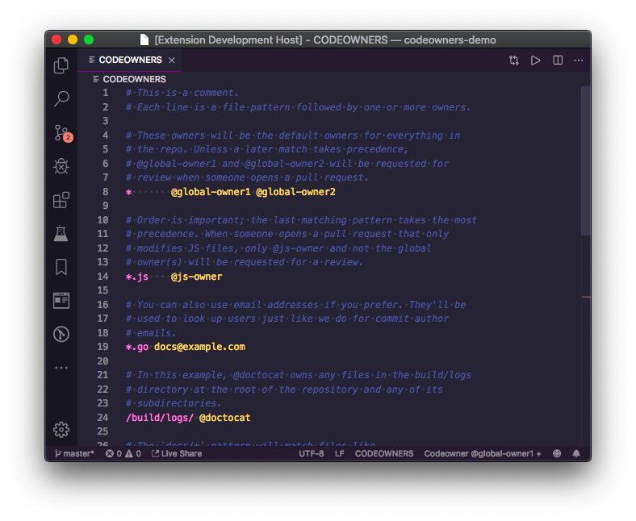
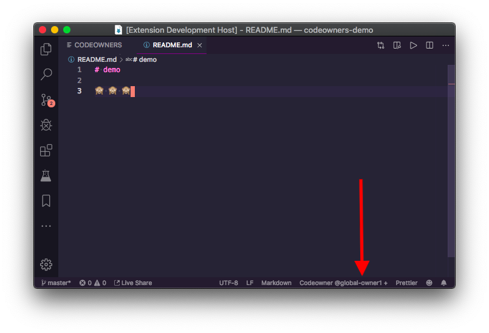

# vs-codeowners

> A [VSCode](https://code.visualstudio.com/) [extension](https://marketplace.visualstudio.com/items?itemName=dtangren.vs-codeowners) for making use of [GitHub CODEOWNERS](https://help.github.com/en/articles/about-code-owners) in your editor

## Install

See the [Requirements](#requirements) section

## Features

* Syntax highlighting for `CODEOWNERS` files



* See the `CODEOWNER` of current file in status bar



* Quick jump to `CODEOWNERS` file

Find a section of a codebase you'd like to claim ownership over? You can click the `CODEOWNERS` status bar item to jump right into the `CODEOWNERS` file to kick off that discussion.


## Requirements

1) Install [`git-codeowners`](https://github.com/softprops/git-codeowners) first


💡 Git Codeowners is a command line tool for that extends your git workflow to query a repository's GitHub `CODEOWNERS` files.

It can easily be installed using homebrew. See the project's [`README`](https://github.com/softprops/git-codeowners#readme) for more information.

```sh
$ brew tap softprops/tools
$ brew install git-codeowners
```

2) Install this extension from the [VSCode Marketplace](https://marketplace.visualstudio.com/items?itemName=dtangren.vs-codeowners) (or by entering `ext install dtangren.vs-codeowners` at the command palette `Ctrl+P`).

## Known Issues

Find a 🐛 or have an idea for a feature? Open an issue [here](https://github.com/softprops/vs-codeowners/issues/new) and let us know what you think?

## Release Notes

### 0.0.1

Initial MVP release